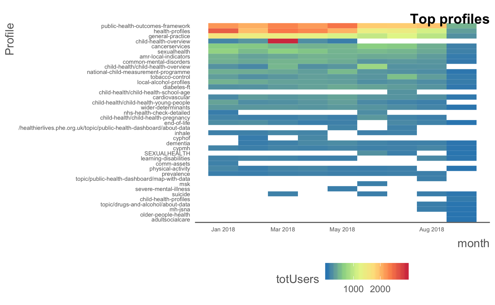

```{r setup, include=FALSE}
knitr::opts_chunk$set(echo = FALSE, cache = TRUE, warning = FALSE)


library(pacman)
#devtools::install_github("julianflowers/myScrapers")
p_load(hansard, rtweet, RGA, tidyverse, quanteda, tidytext, myScrapers, readtext, fingertipsR, data.table)


```

# Introduction

These are some random thoughts on using non-epidemilogical data t get insight into current public health priorities. The Health Profile for England is clearly the starting point for conventional public health analytics but the growth of big data, especially in *variety*, new forms of data access such as APIs and mainstreaming data science techniques like web-scraping and natural language processing (NLP) have extended the range of analysis of insights we can get from a wide range of users and stakeholders.

The document gives an overview of possible insight from some of these sources:

* Opinion surveys - PHE IPSOS MORI survey and LGA survey of DsPH
* PHE publications on GOV.UK
* Twitter feeds
* DPH reports
* Google analytics 

The data, public and LA views and DPH reports emphasize that mental health, ageing and dementia are of widespread concern. PQs don't quite reflect this although suicide is high on the list of PQ frequency, as are prescription drugs - usually drugs of addiction. 


## PHE Publications

PHE has published nearly 4000 documents or statistical releases to GOV.UK (see searchable catalogue below). The vast majority of these are related to health protection.

```{r phe-cat}

phe_cat <- myScrapers::get_phe_catalogue(n = 110)

phe_cat  
  


```

Fingertips profiles are a major publishing route for Health Intelligence (the number of profiles has been rationalised from 67 to 54.)

```{r fingertips_stats}

fingertips_stats()

```


## Remit letters

To be added

```{r}

```


## PHE Strategy and business plans

To be added

```{r}

```


## IPSOS MORI PHE Surveys

Brief summary of 2017 IPSOS MORI PHE Public Opinion Survey (via PHE Board Papers) shows that about half of the general public surveyed thought PHE published health information and the top 3 topics unprompted health concerns were cancer, mental health and dementia (see below).

```{r mori-poll}

mori <- readtext("../data/PHE17-29 (1 of 2) public opnion survey  FINAL.pdf")

mori_result <- mori$text %>%
  str_split(., "\\n") %>%
  .[[1]] %>%
  .[c(21:24, 53:63)] %>%
  str_remove("4.1|a\\)|b\\)|c\\)|5.2") %>%
  .[-12] %>% tm::stripWhitespace()

```

> `r mori_result`

## Politics

Another route to understanding PHE priorities is through reviewing parliamentary questions. These reflect both constituency and national concerns and tend to reflect contemporary issues. The chart below summarises questions answered by or relevant to PHE in 2018 so far. The breast screening scare dominatesm but other frequently asked questions are about alocholic drinks, dentistry, prescription drugs, some cancers and a range of communicable disease and services.

```{r hansard, fig.height=10, fig.width=10}


dhsc2018 <- hansard_all_answered_questions(start_date = "2018-01-01", verbose = FALSE) %>% filter(str_detect(answering_body, "[Hh]ealth"))

dhsc2018 <- dhsc2018  %>%
  mutate(answer_text_value =str_replace_all(answer_text_value, "\\<.?p\\>", ""))

phe_qn <- filter(dhsc2018, str_detect(answer_text_value, "Public Health England|PHE")) %>%
  select(date_of_answer_value, question_text, tabling_member_printed, answer_text_value, answering_member_printed_value,
         answering_member_constituency_value, hansard_heading_value, attachment) 

phe_qn <- filter(dhsc2018, str_detect(answer_text_value, "Public Health England|PHE")) %>%
  select(date_of_answer_value, question_text, tabling_member_printed, answer_text_value, answering_member_printed_value,
         answering_member_constituency_value, hansard_heading_value, attachment) 

health_categories <- phe_qn %>%
  group_by(hansard_heading_value) %>%
  separate(hansard_heading_value, c("first", "second"), ":") %>%
  group_by(first) %>%
  count() %>%
  filter(n > 0) %>%
  ggplot(aes(fct_reorder(first, n), n,  fill = n)) +
  geom_col() +
  coord_flip() +
  theme(axis.text = element_text(size = 10)) +
  viridis::scale_fill_viridis(name = "Frequency") +
  labs(title = "PQ frequency by category in 2018", y = "Question frequency", 
       caption = "Source: Hansard API")

health_categories


```

## Duncan Selbie's friday messages

To be added

```{r}

```

## Twitterbot for public health data science

A Twitter bot is a type of bot software that controls a Twitter account via the Twitter API. We have set one up that searches Twitter for key words and retweets any tweets that relates to public health data science [check with Alex] with the hashtag #public-health-data-science. It has the Twitter handle *@PublicHealthBot*. 

```{r twitter-bot}

ph_bot_tweets <- rtweet::get_timeline("@PublicHealthBot", n = 3200)

ph_bot_tweets %>%
  mutate(date = substr(created_at, 1, 10)) %>%
  group_by(date) %>%
  count(n = n()) %>%
  ggplot(aes(as.Date(date), n,  group = date)) +
  geom_point() +
  geom_smooth(aes(group = date)) +
  scale_x_date(breaks = "months") +
  govstyle::theme_gov() +
  labs(title = "Daily retweets from @PublicHealthBot",
       x = "Date") 
  
n_followers <- rtweet::get_followers("@PublicHealthBot")  


hashtag_harvest <- ph_bot_tweets %>%
  unnest(hashtags) %>%
  pull(hashtags) %>%
  unique()

bot_retweets <- ph_bot_tweets %>%
  group_by(status_id) %>%
  summarise(n= n(), retweets = sum(retweet_count)) %>%
  arrange(-retweets)

head(bot_retweets, 10) %>%
  left_join(ph_bot_tweets)

bot_corpus <- corpus(ph_bot_tweets)


dfm_tweets <- dfm(bot_corpus, ngrams = 1:3, remove = c(stopwords("en"), "https", "t.co", "https_t.co"), tolower = TRUE, remove_twitter = TRUE, remove_punct = TRUE)

prune <- dfm_trim(dfm_tweets, min_termfreq = 2, max_termfreq = 150)

textplot_wordcloud(prune)

```

The bot retweets about 25 tweets a day and to date has `r nrow(n_followers)` followers. The content tends to be mostly US originated but it captures some important elements of the debate about the role of big data and data science in public health.

The most freqently retweeted messages are `r head(bot_retweets, 10) %>% left_join(ph_bot_tweets) %>% select(text) %>% knitr::kable()` and the wordcloud gives a flavour of frequently mentioned terms for example *big data*, *machine learning*, *population health*.

Twitter Bots are quite easy to set up and could be established to track topics of interest. They don't involve any direct tweeting and are not official PHE channels.

We can also look at the content of PHE tweets for example, the new HeartAge calculator (launched on 4th September) has created social media interest. As we can see below the reaction as measured by sentiment on Twitter reaction at least has been somewhat mixed with many comments on the fact is seems to overestimate heart age especially if people don't know their cholesterol or BP, and it encourages under 40s to attend their GP if these numbers aren't known.

```{r heart-age}
heart_age <- rtweet::search_tweets("#HeartAgeTest", n = 18000, retryonratelimit = TRUE)
heart_age %>%
  select(created_at, quoted_text) %>%
  na.omit() %>%
  unnest_tokens(word, quoted_text) %>%
  inner_join(get_sentiments("bing")) %>%
  group_by(date = substr(created_at, 1, 10)) %>%
  count(sentiment) %>%
  spread(sentiment, n, fill = 0) %>%
  mutate(score = positive - negative) %>%
  ggplot(aes(date, score, fill = score)) +
  geom_col() + 
  govstyle::theme_gov() +
  scale_fill_gradient2(low = "red", mid = "yellow", high = "green") +
  labs(title = "Sentiment analysis of twitter feedback to #HeartAgeTest", 
       subtitle = "Negative scores indicate negative sentiment")
  


```


## News scraping from Google alerts

This is being set up.

```{r}

```


## Facebook

```{r}


```

## Google analytics

```{r analytics, eval = FALSE}

library(higaR)

ga_list <- get_ga_list() %>% as.character(.)
lookup <- list_profiles()

ids <- lookup[lookup$id %in% ga_list, ]$id
names <- lookup[lookup$id %in% ga_list, ]$name
url <- lookup[lookup$id %in% ga_list, ]$websiteUrl
lookups <- data.frame(ids = as.numeric(ids), names = as.character(names), url = url)


start<- "2018-01-01"
lp <- get_ki_landingPages(ids = lookups$ids[1:2], first = start)

profiles_heatmap(ds = lp, title = "Top profiles") +
  theme(axis.text = element_text(size = 6))


```




## Stakeholder feedback

### DPH reports

```{r dph, eval = FALSE}
dph_docs <- fread("~/Documents/R_projects/my_scrapers/dph_reports/dphdocs3.csv")

dph_corpus <- corpus(dph_docs)

dict <- dictionary(list(
  location = c("York", "Leeds"), 
  phe = "phe*", 
  fingertips = "fingertips*", 
  profile = "profile*", 
  local_health = "local*health*",
  public_health_dashboard = "public_health_dashboard*", 
  phof = c("phof", "outcomes_framework"), 
  mental_health = "mental_health", 
  cancer = "cancer",
  smoking = c("tobacco", "smok*"),
  diabetes = "diabetes*", 
  heart = c("heart", "cardio*"), 
  physical_activity = c("physical activit*"), 
  alcohol = c("alcohol", "drink*"), 
  sugar = "sugar*"))

dtm1 <- dfm(dph_corpus, remove = stopwords("en"), remove_punct = TRUE, ngrams = 1:3)

dtm1_small <- dfm_trim(dtm1, min_termfreq = 5, min_docfreq = 3,  )

lookup1 <- dfm_lookup(dtm1_small, dictionary = dict)

mentions <- lookup1 %>% 
  data.frame() %>%
  group_by(document) %>%
  gather(topic, value, phe:sugar) %>%
  mutate(mention = ifelse(value == 0, 0, 1)) %>%
  group_by(topic) %>%
  summarise(`% documents` = 100 * round(mean(mention), 2)) %>%
  arrange(-`% documents`)

mentions %>%
  knitr::kable(caption = "% DPH reports containing terms")


```

We have been able to scrape more than 300 DPH reports from the web and using NLP look for phrases or terms in the documents. The table below shows the proportion of reports which contain respective terms.


```{r dph1}
read_csv("~/Documents/R_projects/my_scrapers/dph_reports/mentions.csv") %>%
  knitr::kable()
```

